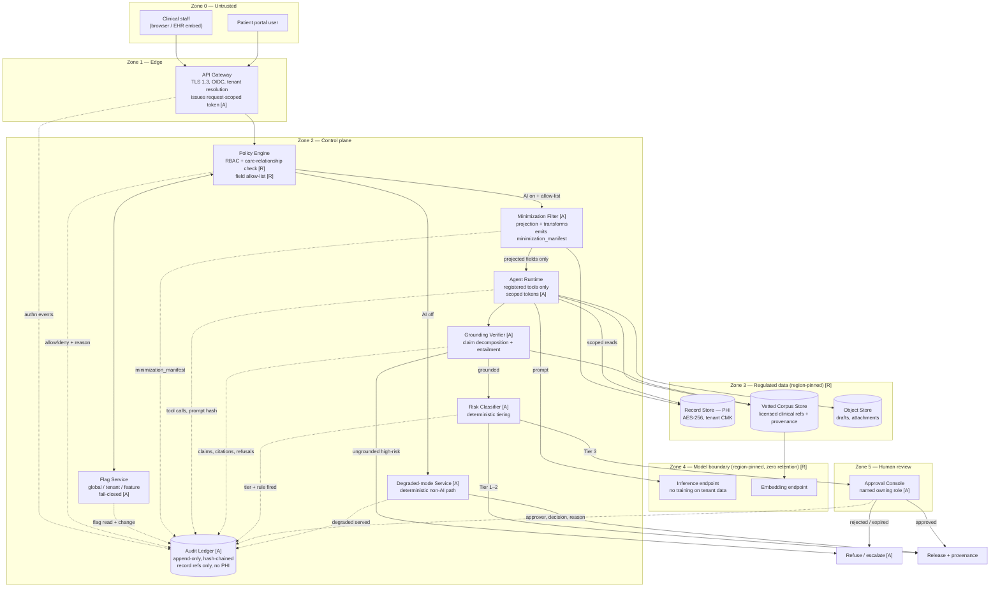
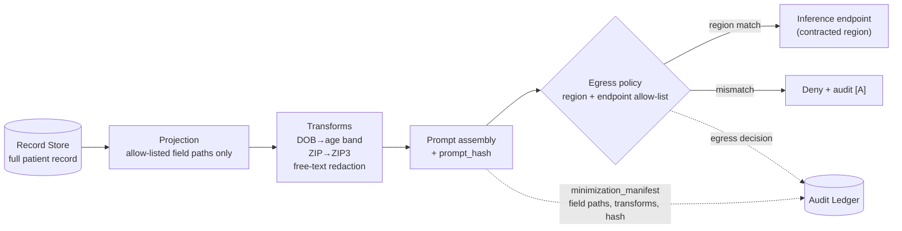
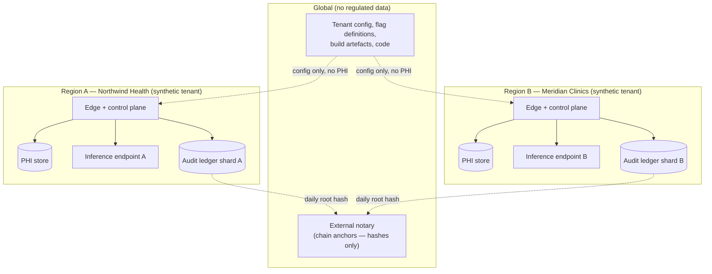

# Container View

Legend: **[A]** = agnostic control, **[R]** = regime-specific control,
`═══` conceptual trust-zone boundary, dotted arrows = audit writes.

## C1 — Container diagram

## C2 — Component view of the model boundary

The single most scrutinised edge in the design: nothing reaches Zone 4 except through the
Minimization Filter.

Two properties this buys:

1. **Injection cannot widen scope.** The Agent Runtime operates on a projection. A prompt
   that says *"also include the patient's SSN"* cannot succeed, because the SSN was never
   materialised in the object the runtime holds.
2. **Minimum-necessary becomes evidence.** The `minimization_manifest` is a per-request,
   hash-chained record of exactly which fields crossed the boundary — the artefact a
   HIPAA reviewer asks for and almost never gets.

## C3 — Deployment / residency view [REGIME]

Regulated data, model endpoints, and ledger shards are all region-pinned per tenant.
Only two things leave a region: tenant configuration (in) and **chain root hashes**
(out) — a hash of a hash, containing no record content. That is what makes external
notarisation compatible with residency.

Cross-references: [`data-handling/minimization-and-residency.md`](../data-handling/minimization-and-residency.md),
[`architecture/trust-boundaries.md`](trust-boundaries.md), [ADR-004](../adrs/ADR-004-residency-approach.md).
