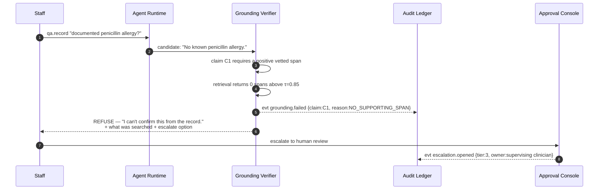
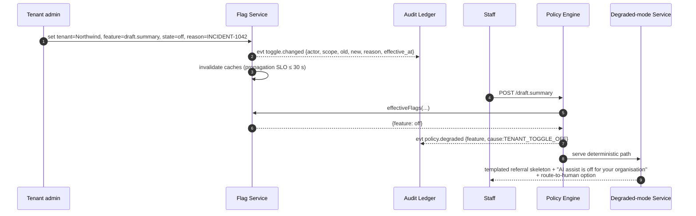
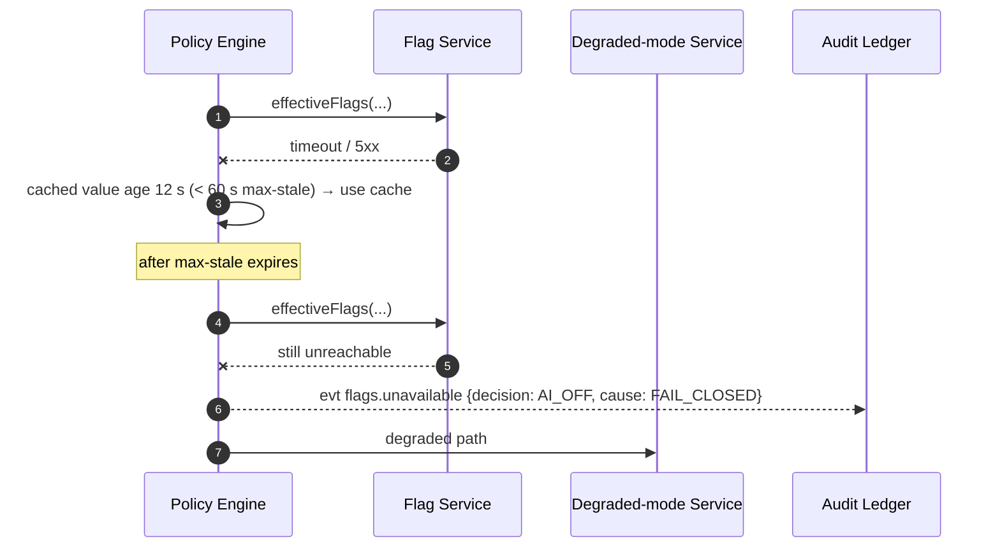
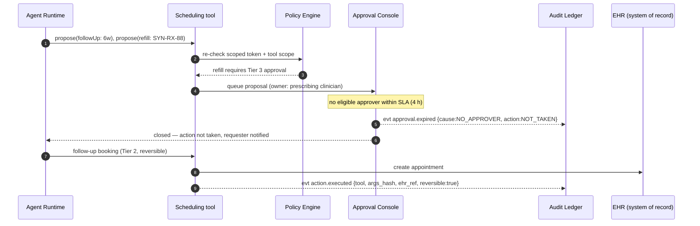

# Sequence Views

Five paths. Together they exercise every FR and every fail-closed rule.
All identifiers are synthetic (`SYN-*`).

---

## S1 — High-risk path, approved (FR-1 → FR-4, happy path)

*Scenario:* Dr. R. Alvarez (synthetic user `SYN-USR-4471`, tenant `Northwind Health`)
asks CARA to draft a referral letter for patient `SYN-MRN-000123`.

```mermaid
sequenceDiagram
  autonumber
  participant U as Clinician (SYN-USR-4471)
  participant GW as API Gateway
  participant POL as Policy Engine
  participant FLG as Flag Service
  participant MIN as Minimization Filter
  participant AGT as Agent Runtime
  participant LLM as Inference (region A)
  participant GRD as Grounding Verifier
  participant RSK as Risk Classifier
  participant CON as Approval Console
  participant LED as Audit Ledger

  U->>GW: POST /draft.summary {patient: SYN-MRN-000123}
  GW->>GW: OIDC authn; issue scoped token (TTL 5m)
  GW-->>LED: evt authn.success
  GW->>POL: authorize(capability=draft.summary, patient)
  POL->>POL: RBAC + care-relationship check [REGIME: minimum-necessary]
  POL->>FLG: effectiveFlags(tenant, feature=draft.summary)
  FLG-->>POL: {global:on, tenant:on, feature:on} (ttl 30s)
  POL-->>LED: evt policy.allow {reason:CARE_REL_OK, flags:snapshot}
  POL-->>MIN: allow-list [problems, meds, last_2_encounters, age_band]
  MIN->>MIN: project + transform (DOB→age band, drop MRN/name)
  MIN-->>LED: evt minimization.applied {manifest, prompt_hash}
  MIN->>AGT: minimized context
  AGT->>LLM: prompt (region-pinned, zero retention)
  LLM-->>AGT: candidate draft
  AGT-->>LED: evt agent.tool_calls {n:3, tool ids, hashes}
  AGT->>GRD: candidate + claims
  GRD->>GRD: decompose → 7 atomic claims; retrieve vetted spans
  GRD-->>LED: evt grounding.result {7/7 supported, citation ids}
  GRD->>RSK: grounded candidate
  RSK-->>LED: evt risk.classified {tier:3, rule:R3-PATIENT-ASSERTION}
  RSK->>CON: queue for owning role = supervising clinician
  CON->>U: review UI (draft + citations + manifest summary)
  U->>CON: edit-and-approve (2 edits, reason=CLARITY)
  CON-->>LED: evt approval.granted {approver, edits_hash, reason}
  CON->>U: released output + provenance panel
```

Ledger events written: 9. Everything an auditor needs to reconstruct the decision —
including the exact fields that crossed the model boundary and the citations the
clinician saw — is in the chain. See the [auditor walkthrough](../stretch/auditor-walkthrough.md).

---

## S2 — Fail-closed on grounding (FR-4, NFR-4)

*Scenario:* Staff ask a Tier-3 question whose answer is not present in the patient's
record or the vetted corpus ("does this patient have a documented penicillin allergy?"
where the record is silent).



Two things the design refuses to do here:

- It does not answer *"no allergy"* from the **absence** of a record entry. Absence of
  evidence is not a vetted span; asserting it is a clinical claim.
- It does not silently downgrade to a hedged answer. A hedge is still an assertion
  delivered to a clinician. Refuse, disclose the search scope, offer escalation.

The refusal itself is a first-class audited event.

---

## S3 — Toggle off → degraded mode (FR-5)



And the fail-closed variant:



Unknown flag state means AI **off**. A kill switch that stays on when its control plane
is down is theatre.

---

## S4 — Low-risk auto-flow (FR-3 lower tier)

```mermaid
sequenceDiagram
  autonumber
  participant U as Staff
  participant POL as Policy Engine
  participant AGT as Agent Runtime
  participant GRD as Grounding Verifier
  participant RSK as Risk Classifier
  participant LED as Audit Ledger

  U->>POL: qa.general "what's our no-show policy?"
  POL-->>LED: evt policy.allow {no patient in context}
  POL->>AGT: (no PHI in scope; allow-list empty)
  AGT->>GRD: candidate + claims
  GRD-->>LED: evt grounding.result {2/2 supported: tenant policy corpus}
  GRD->>RSK: grounded candidate
  RSK-->>LED: evt risk.classified {tier:1, rule:R1-NON-SPECIFIC}
  RSK-->>U: released automatically with citations
```

Tier 1 flows without a human — but not without grounding and not without a log. The
distinction between "no human" and "no control" is the whole point of the taxonomy.

---

## S5 — Bounded action with fail-closed authorization (FR-2, NFR-2, NFR-4)

*Scenario:* `action.schedule` proposes a 6-week follow-up and a refill request.



Note the asymmetry: a reversible, non-clinical booking flows at Tier 2; an irreversible
medication action expires **closed** rather than defaulting to execution. Irreversibility
is the axis the threshold turns on ([`hitl/risk-taxonomy.md`](../hitl/risk-taxonomy.md)).
