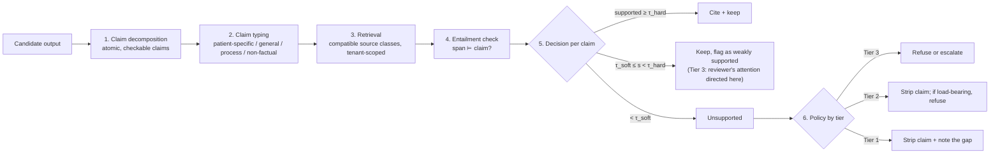

# Hallucination Containment — FR-4 [AGNOSTIC]

**The control is grounding-or-refuse. It is not model confidence, not prompt instructions,
and not a disclaimer.** A confident wrong answer and a confident right answer are
indistinguishable from the inside; the containment therefore lives outside the model.

## 1. Pipeline



### Step 1 — Claim decomposition
The candidate is split into atomic claims: one assertion each, self-contained
(pronouns resolved), independently checkable. Non-factual spans (greetings, hedges,
structure) are typed `non-factual` and exempt — but "exempt" is recorded, so an auditor
can see nothing was quietly excused. Anything not confidently typed as non-factual is
treated as a claim.

### Step 2 — Claim typing
Determines which source classes may support it
([compatibility matrix](vetted-sources.md#4-claim-type--source-class-compatibility)).
A patient-specific fact requires an **S1** span; nothing else can substitute.

### Step 3 — Retrieval
Hybrid retrieval (lexical + dense) over the tenant-partitioned index, filtered at the
index level by tenant, source class, and validity window. Retrieval returns spans with
offsets and document versions, never whole documents, so the citation is precise enough
to check in a review UI.

### Step 4 — Entailment
Each (claim, span) pair gets an entailment decision from a verifier model run
**separately from the generator**, plus deterministic checks for the classes where a
model is the wrong tool:

| Check | Applies to | Method |
|---|---|---|
| Numeric fidelity | Any claim containing a number, dose, date, or unit | Exact match against the source span, including units. A number not present in a span is unsupported, no matter what the entailment score says. |
| Negation/polarity | Claims asserting absence ("no known allergy") | Requires a **positive** span asserting the absence (e.g. an explicit "no known drug allergies" entry). Empty fields never support absence claims. |
| Temporal fidelity | Claims with a time reference | Span date must match the claimed time frame |
| Entity binding | Patient-specific claims | The span must come from **this** patient's record; a span from a different subject fails regardless of similarity |

The deterministic checks are veto-only: they can fail a claim the entailment model passed,
never the reverse.

### Step 5 — Thresholds

| Symbol | Value | Meaning |
|---|---|---|
| `τ_hard` | 0.85 | At or above: supported, cited |
| `τ_soft` | 0.60 | Between soft and hard: kept but flagged as weakly supported; Tier 3 reviewers see it highlighted |
| below `τ_soft` | — | Unsupported |

The values are calibrated on a held-out synthetic evaluation set and are **versioned
configuration owned by the Clinical Safety Officer** (DC-10 / ADR-002), recorded in every
`grounding.result` event, so a past decision can be re-evaluated against the thresholds in
force at the time. Changing them requires an ADR amendment and a re-run of the eval suite.

Calibration principle: **tune for recall of unsupported claims, not for precision.** The
cost of a false "unsupported" is a refusal (annoying, safe); the cost of a false
"supported" is an ungrounded clinical assertion released to a clinician (the failure this
whole system exists to prevent).

### Step 6 — Policy by tier

| Tier | Unsupported claim | Rationale |
|---|---|---|
| **3** | **Refuse the whole output**, or escalate to human review with the gap named | A Tier-3 output with one unsupported clinical claim is not partially safe |
| **2** | Strip the claim and note the removal; if the claim was load-bearing (the output is unintelligible or misleading without it), refuse | Summaries can survive losing a marginal claim; they cannot survive losing their point |
| **1** | Strip the claim, note the gap, offer escalation | Low harm, but never silently fabricated |

## 2. Refusal behaviour

A refusal is a **specific, useful, audited artefact**, not an error page:

```
I can't answer that from the record.

I searched: Ada Fictionalis's structured record (problems, medications, labs,
allergies, notes from the last 24 months) and Northwind Health's clinical protocols.

The record contains no entry either recording or excluding a penicillin allergy.
An empty allergy list isn't the same as a documented absence, so I won't state
either way.

Options: [Escalate to Dr. Alvarez] [Show me what the record does contain]
```

Properties that matter:
- **Names the search scope.** A refusal that doesn't say what was searched is
  indistinguishable from a malfunction, and users route around it.
- **Explains the distinction** it is drawing (silence ≠ absence).
- **Offers escalation** — refusal is a handoff, not a dead end.
- **Never hedges into an assertion.** "Probably no allergy" is the failure mode a hedge
  produces; it is an assertion with deniability.

Refusals are audited: `grounding.failed {claim_id, claim_type, reason_code, searched_scope, top_scores}`.
Refusal *rates* are a monitored quality signal — a rising rate usually means a corpus gap
(fix: admit a source), not a model problem (fix: prompt).

## 3. Citation presentation

Every released Tier 2/3 output carries per-claim citations resolving to
`(doc_id, version, span_offsets)`, rendered inline and expandable. A citation the reviewer
cannot open is not a citation. Tier 1 outputs carry document-level citations.

## 4. Multi-step agent loops — the circularity guard

In an agentic loop, step *n*'s output becomes step *n+1*'s input. Without a guard, an
ungrounded intermediate becomes a grounded-looking premise. Guards:

1. Intermediate outputs are tagged `provenance: model_generated` and are **never**
   admissible as grounding spans.
2. Claims are verified against the **original vetted spans** at final output time, not
   against intermediate reasoning.
3. Retrieval results are carried forward by reference, so the final citation points at the
   source document, not at the agent's paraphrase of it.
4. Tool outputs (e.g. a scheduling API response) are `provenance: system_of_record` and
   *are* admissible for claims about system state — a distinct class from model output.

## 5. Where this can still fail (stated honestly)

| Residual risk | Mitigation | Residual |
|---|---|---|
| Verifier model errs on a subtle claim | Deterministic vetoes for numbers/dates/negation/entity; Tier-3 HITL | Non-zero; bounded by human review |
| Misleading by **omission** — every claim true, the whole misleading | Sampled human review; reviewers see the minimization manifest so "what wasn't included" is visible | Real. Grounding checks claims, not completeness. Recorded as OQ-4 |
| Source itself is wrong | Corpus review triggered by `CLINICALLY_WRONG` rejections | Depends on tenant corpus hygiene |
| Over-refusal degrades trust and drives workarounds | Refusal-rate monitoring; corpus gap remediation | Accepted; over-refusal is the safe direction |

Stating these is part of the control. An architecture claiming hallucination is *solved*
would be making exactly the kind of unfalsifiable claim it is built to prevent.

## 6. Portability note

The pipeline, the thresholds' existence, the prohibition on self-grounding, the
refuse-or-escalate policy, and the deterministic vetoes are **unchanged** in every sector.
What is re-bound: the source classes, the claim-type matrix, and which tier a given claim
type lands in. See [portability](../portability/portability-analysis.md) §FR-4.
