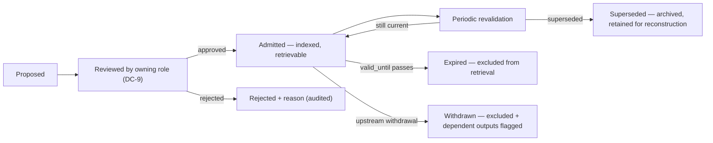

# Vetted Sources — FR-4 [AGNOSTIC mechanism, REGIME source set]

"Grounded in vetted sources" is meaningless until *vetted* is defined operationally. This
document defines it for healthcare and states the admission criteria that would be
re-bound in any other sector.

## 1. Definition

> A **vetted source** is a document or record span that is (a) admitted to a tenant's
> corpus by a named accountable role, (b) versioned with known provenance, (c) currently
> valid, and (d) authoritative for the *kind of claim* it is used to support.

Clause (d) does the heavy lifting: a source can be perfectly authoritative and still be
the wrong grounding for a particular claim. A drug monograph is authoritative for dosing
ranges and not for what *this patient* was prescribed. The verifier enforces a
**claim-type → source-class** compatibility matrix (§4).

## 2. Source classes admitted for healthcare

| Class | Contents | Authoritative for | Admitted by |
|---|---|---|---|
| **S1 — Patient record** | The patient's own structured record and notes in the tenant's system of record | Facts *about this patient* | System of record (EHR) — inherently admitted, versioned by encounter |
| **S2 — Tenant clinical protocol** | The tenant's own approved protocols, referral criteria, order sets | What *this organisation* does | Tenant Clinical Informatics Lead (DC-9), signed manifest |
| **S3 — Licensed clinical reference** | Licensed reference works and monographs under a tenant licence | General clinical facts | Tenant licence + informatics sign-off |
| **S4 — Tenant operational policy** | Scheduling, billing, records-request policies | Operational/administrative questions | Tenant Operations Manager |
| **S5 — Regulatory/statutory text** | Published rules the tenant is subject to | Compliance/administrative claims | Vendor, versioned by publication date |

## 3. Explicitly *not* vetted sources [AGNOSTIC prohibition]

| Not a vetted source | Why |
|---|---|
| **The model's own prior output** | Circular grounding: an unsupported claim becomes "supported" by having been said. This is the single most dangerous shortcut in an agentic loop, because multi-step agents naturally consume their own intermediate output. |
| **The model's parametric knowledge** | Unversioned, unattributable, unauditable. Fluency is not provenance. |
| **The open web / general search** | Unvetted, unstable, not licensed, not attributable at review time. |
| **Another tenant's corpus or records** | Isolation and licensing violation (T7). |
| **User assertions in the conversation** | A staff member saying "she's allergic to penicillin" is a claim, not a record. It may *prompt* a record check; it cannot ground a clinical assertion. It may be quoted as a reported statement, attributed as such. |
| **Expired or withdrawn documents** | `valid_until` past ⇒ excluded from retrieval (FC-10). |

The prohibition on self-grounding is enforced structurally: retrieval draws only from the
corpus store and the record store, and the agent's intermediate outputs are never written
into either.

## 4. Claim-type → source-class compatibility

| Claim type | Valid source classes | Example |
|---|---|---|
| Patient-specific fact | **S1 only** | "Last A1c was 7.4% on 2026-07-30" ← record span |
| Patient-specific recommendation | **S1 + (S2 or S3)** | "Meets endocrinology referral criteria" ← record values + `SYN-VS-CLIN-002` criteria |
| General clinical fact | S3 (or S2 where the tenant has localised it) | "Metformin is typically taken with meals" |
| Organisational process | S2 or S4 | "Referrals are triaged within 5 business days" |
| Compliance/administrative | S4 or S5 | "Records requests are answered within 30 days" |

A claim with no compatible source class **cannot be grounded**, even if a high-similarity
span exists. Retrieval similarity is not authority.

## 5. Corpus document metadata

```json
{
  "doc_id": "SYN-VS-CLIN-002",
  "title": "Northwind Health — Referral Criteria, Endocrinology",
  "class": "S2",
  "tenant": "SYN-TEN-northwind",
  "version": "4.1",
  "content_hash": "sha256:7e21…",
  "admitted_by": "SYN-ROLE-CIL@SYN-TEN-northwind",
  "admitted_at": "2026-02-02T00:00:00Z",
  "valid_from": "2026-02-05",
  "valid_until": "2027-06-30",
  "review_status": "current",
  "supersedes": "SYN-VS-CLIN-002@4.0",
  "authoritative_for": ["organisational_process", "patient_specific_recommendation"],
  "region": "region-a"
}
```

Every citation in an output resolves to `(doc_id, version, span_offsets, content_hash)`,
so a decision reviewed two years later can be re-examined against **the text as it stood
at the time**, even if the document has since been revised.

## 6. Lifecycle



**Withdrawal is the interesting edge.** When `SYN-VS-REF-019` is withdrawn upstream, the
citation index is queried in reverse: every past output citing it is listed, and outputs
still in force (e.g. a referral letter awaiting action) are flagged to the owning role for
re-review. Archived versions are retained — otherwise past decisions become
unreconstructable, which breaks NFR-3.

## 7. Corpus hygiene metrics

| Metric | Why it matters |
|---|---|
| % of retrieval hits from expired/superseded docs | Should be 0; non-zero means the exclusion filter is broken |
| Refusal rate attributable to corpus gaps | High rate ⇒ the fix is a missing source, not a prompt tweak |
| Median document age by class | Stale S2 protocols are a clinical risk in their own right |
| Coverage: top-50 question clusters with ≥ 1 compatible source | Directly predicts refusal rate |

## 8. Portability note

Only the **source classes** change across the menu. The definition, the compatibility
matrix, the admission-by-named-role rule, the prohibition list, and the lifecycle are
identical in all four sectors:

| Sector | S1 analogue | S2/S3 analogue |
|---|---|---|
| Healthcare | Patient record | Tenant protocols, licensed clinical references |
| Finance | Customer's account/transaction system of record | Product terms, disclosure templates, regulatory text |
| Public sector | The official case/records file | Statute, published policy, records schedule |
| Edtech | Student's education record | Curriculum standards, district policy |
