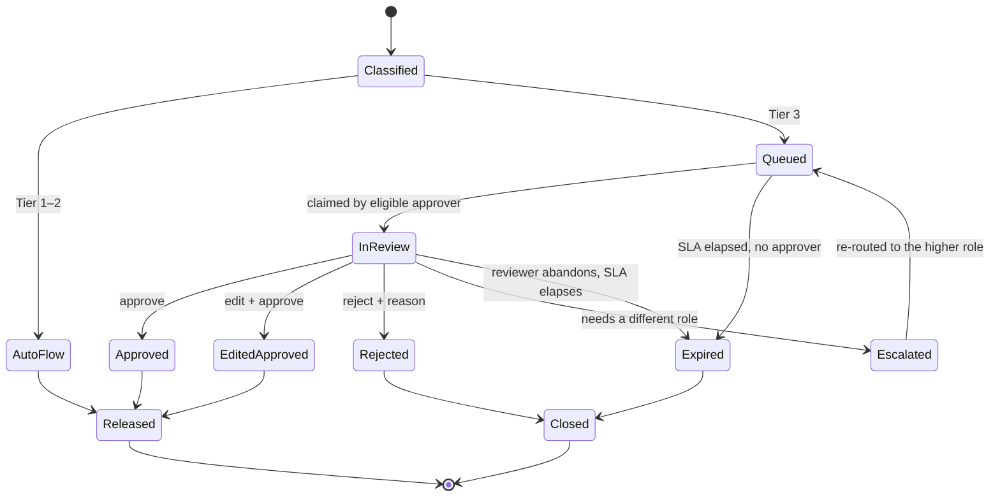

# Approval & Escalation Flows — FR-3

## 1. State machine

`Expired` and `Rejected` both terminate in **Closed — action not taken**. There is no edge
from any state to `Released` that bypasses a human for Tier 3. That absence is the
control; an auditor should look for it explicitly.

## 2. Approval SLAs and expiry

| Context | Review SLA | On expiry |
|---|---|---|
| Interactive (requester is present) | 15 min | Expire closed; requester told the output was withheld and why |
| Asynchronous drafting | 4 h | Expire closed; item returns to the requester's queue as "not generated" |
| Bounded action (`action.schedule`) | 4 h | Expire closed; **action not taken** (S5) |

Expiry is not deferral-to-default. The default is *no output*.

## 3. What the reviewer sees

An approval screen that shows only the proposed text is a rubber stamp with extra steps.
The console presents:

1. **The proposed output**, with each high-risk claim inline-linked to its citation.
2. **The citations themselves**, expandable to the retrieved span in the vetted document,
   with document ID, version, and `valid_until`.
3. **Any claim the verifier flagged as weakly supported** (entailment score between the
   soft and hard thresholds), highlighted — the reviewer's attention is directed at the
   shakiest content rather than spread evenly.
4. **The minimization manifest summary** — what the model was given. Reviewers routinely
   catch "it didn't know about X" errors here.
5. **The risk tier and the rule that fired.**
6. **The diff**, if this is a re-generation after an edit.

Every one of those panels exists because approving without it means approving something
the reviewer cannot actually evaluate.

## 4. Reviewer actions and their audit records

| Action | Required | Ledger event |
|---|---|---|
| Approve | — | `approval.granted {approver, role, tier, content_hash, dwell_ms}` |
| Edit and approve | Edits captured as a diff | `approval.granted {edits_hash, edit_count, dwell_ms}` |
| Reject | Reason code from a fixed list (`UNSUPPORTED_CLAIM`, `CLINICALLY_WRONG`, `WRONG_PATIENT`, `TONE_OR_FORMAT`, `NOT_NEEDED`, `OTHER`+text) | `approval.rejected {reason_code}` |
| Escalate | Target role | `escalation.opened {from_role, to_role, reason}` |

**Rejection reason codes are a quality instrument, not paperwork.** `UNSUPPORTED_CLAIM`
rates feed the grounding threshold review; `WRONG_PATIENT` is a P1 incident trigger;
`CLINICALLY_WRONG` with grounding present means a vetted source may be wrong or stale and
triggers a corpus review (DC-9).

## 5. Eligibility rules

An approver is eligible when **all** hold:

- Holds the owning role for the decision class ([accountability model](../audit/accountability-model.md)).
- Has a current care relationship with the patient, or holds a covering delegation.
- Is not the agent, and is not the same identity as any service account.
- Has an active session with re-authentication if the session is older than 12 h.

**Self-approval by the requester is permitted** in this design when the requester holds the
owning clinical role — the clinician who asked for a referral draft is the right person to
approve it, and requiring a second clinician would be a different (much heavier) control.
What is *not* permitted is approval by anyone without the role, and what is *recorded* is
the fact that requester and approver were the same identity, so a reviewer can audit that
pattern.

## 6. Anti-rubber-stamp instrumentation

| Signal | Threshold | Response |
|---|---|---|
| Median dwell time per approver | < 3 s on Tier-3 items | Flag to Clinical Safety Officer; console introduces a citation-acknowledgement step for that approver |
| Approval rate | 100 % over ≥ 50 items | Governance review (not automated punishment) |
| Citation panel never expanded | > 90 % of items | Same |
| Queue depth | > 2× rolling p95 | Alert; consider narrowing capability scope, **never** lowering the tier |

These are governance signals reviewed by a human role. Automating a punitive response to a
clinician's review behaviour would be both wrong and counterproductive; the point is to
surface a pattern to someone accountable for it.

## 7. Escalation paths

| Trigger | Escalates to | Behaviour while pending |
|---|---|---|
| Grounding failure on a Tier-3 claim | Supervising clinician queue | Output withheld; requester sees the refusal + what was searched |
| Reviewer lacks the required role | Named higher role | Item re-queued, original reviewer's view is read-only |
| Suspected wrong patient | Privacy Officer + immediate P1 | Item frozen, correlation ID pinned for investigation |
| Repeated refusals on the same question (≥ 3 in 24 h for one subject) | Clinical informatics | Signals a corpus gap, not a model problem — the fix is a source, not a prompt |

## 8. Degraded interaction with toggles

If AI is turned off while items sit in the approval queue, queued items are **not**
auto-released and **not** silently dropped. They are marked `held_by_toggle`, remain
visible to reviewers, and can be approved (a human approving text a human can read is not
an AI feature) or discarded. The toggle event and the disposition of each held item are
both audited. See [`toggles/degraded-mode.md`](../toggles/degraded-mode.md).
