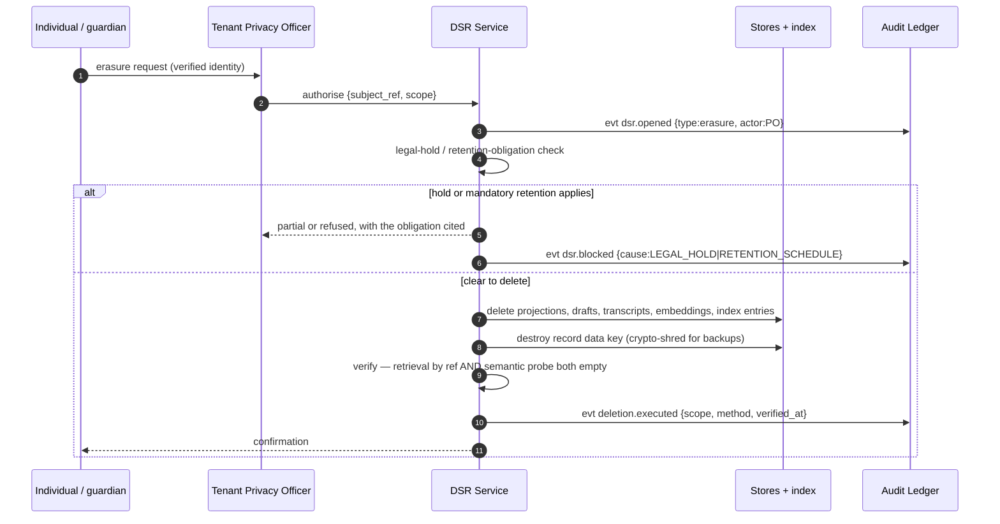

# Consent, Erasure, and Data-Subject Rights

**Stretch goal:** add a consent/erasure flow and show how the agent and the audit log honor
it.

HIPAA frames these as individual rights (access §164.524, amendment §164.526, accounting of
disclosures §164.528, restriction §164.522) rather than as consent. The flow below is built
generically so it also carries the consent-gate semantics that
[edtech requires](../portability/sector-deltas.md#part-2--education-technology) — the design
is deliberately more general than HIPAA needs, because the portability analysis showed
consent to be the biggest structural difference on the menu.

## 1. Request types

| Type | Source obligation | Agent's role |
|---|---|---|
| **Access** | §164.524 | Assemble what CARA holds for a record ref: cached projections, drafts, transcripts, and the disclosure list |
| **Amendment** | §164.526 | Link the amendment to the original artefact hash; mark superseded output; never silently rewrite |
| **Accounting of disclosures** | §164.528 | `disclosures_by_subject` query output |
| **Restriction** | §164.522 | Set `ai_processing_restricted`; agent stops processing that record |
| **Erasure** | State law / tenant policy | Hard delete + crypto-shred, with verification |
| **Consent (grant/withdraw)** | *(edtech)* | Gate processing before it starts |

## 2. Erasure flow



Notes:

- **Embeddings are in scope.** They are classified D2 ([ADR-009](../adrs/ADR-009-no-training-on-tenant-data.md));
  deleting the note and keeping its embedding is not deletion.
- **Backups are handled by crypto-shredding**, because selective deletion inside immutable
  backups is not achievable; the record's data key is destroyed and the ciphertext becomes
  unrecoverable.
- **Verification is two-pronged** — by reference *and* by semantic probe — because an index
  entry can survive a primary-store delete.
- **The public-sector inversion applies here too:** under a records schedule, erasure may be
  *prohibited*. The `dsr.blocked` branch is not an edge case; in some regimes it is the
  normal path.

## 3. How the audit log honors erasure without breaking

The ledger holds **references and hashes only** ([ADR-006](../adrs/ADR-006-audit-log-design.md)),
so after erasure:

- The chain still verifies (hashes of deleted content are still hashes).
- The *fact* of each decision, its actor, its approver, and its timing survive — which is
  what the retention obligation requires.
- The clinical content is gone — which is what the erasure right requires.
- `deletion.executed` is itself a chained entry, so the tenant can **prove** deletion
  occurred, to whom, when, and by what method.

Erasure does **not** remove audit entries. If it did, a subject-rights request would become
an audit-trail-laundering mechanism — request erasure, lose the evidence of what was done
with the data. The reference-only design is what lets both obligations be satisfied at once
instead of trading one against the other.

## 4. How the agent honors restriction and consent

```
authn → tenant → [lawful-basis gate] → policy/RBAC → flags → minimization → agent
```

The lawful-basis gate resolves:

| State | Behaviour |
|---|---|
| `permitted` (HIPAA treatment basis, or consent on file) | Proceed |
| `restricted` (§164.522) or `consent_withdrawn` | **Degraded path only** — no allow-list issued, request never reaches the Minimization Filter |
| `consent_required, unresolved` | Degraded path; prompt the tenant to resolve |
| Gate unreachable | **Fail closed** — degraded path |

In healthcare the gate is bound to `treatment_basis_satisfied` and is effectively always
true for authorised staff; in edtech it is bound to a verifiable-parental-consent record.
Same gate, different binding — the generalisation the portability analysis asked for
(OQ-6-adjacent, [sector-deltas §4](../portability/sector-deltas.md#part-4--three-findings-the-four-way-comparison-produced)).

## 5. Amendment and the citation index

An amendment to record content can invalidate prior agent output that cited it. On
amendment, the citation index is queried in reverse: outputs citing the amended span are
listed, and any still in force are flagged to the owning role for re-review. Same machinery
as vetted-source withdrawal ([vetted-sources §6](../grounding/vetted-sources.md#6-lifecycle)) —
which is a good sign that the mechanism was the right shape.

## 6. SLAs

| Request | Target | Fail behaviour |
|---|---|---|
| Access | 30 days (statutory), 5 business days operational target | Escalate to Privacy Officer |
| Amendment | 60 days statutory | Escalate |
| Accounting | 60 days statutory | Escalate |
| Restriction | Effective **immediately** on acceptance | Fail closed — restriction applies while the request is processed |
| Erasure | Per tenant policy | Blocked branch cites the obligation |

Restriction taking effect immediately, before the paperwork completes, is deliberate: the
safe direction is to stop processing first and confirm afterwards.
